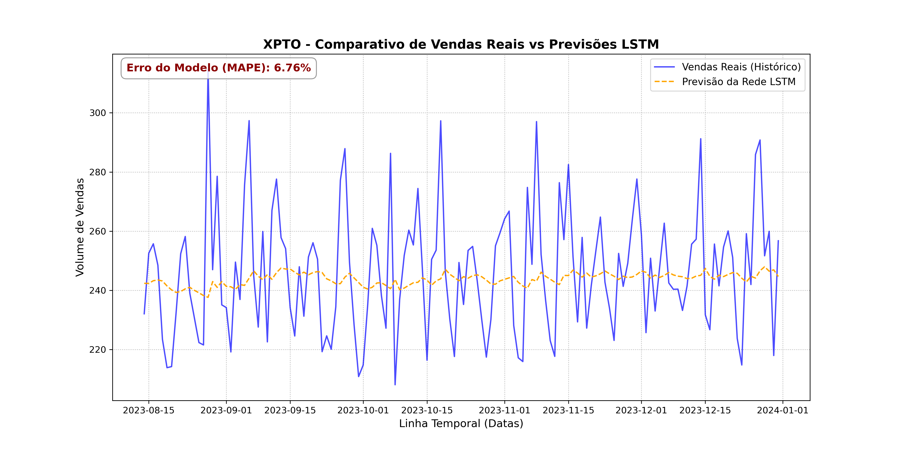

# 📈 Store Sales Forecasting using LSTM Neural Networks

This project was developed as part of the **Artificial Intelligence Course at MasterD**. The main goal is to predict tomorrow's sales volume based on the historical data of the previous 30 days.

## 🛠️ Technologies Used
* **Python 3**
* **Pandas & NumPy:** Data cleaning and preprocessing.
* **TensorFlow & Keras:** Building and training the LSTM neural network.
* **Scikit-Learn:** Data normalization (MinMaxScaler).
* **Matplotlib:** Graphical visualization of results.

## 📊 How It Works
1. The script loads the dataset and filters sales for a single store.
2. Missing values are handled using data interpolation.
3. Data is normalized between 0 and 1 for LSTM stability.
4. The LSTM model is trained for 15 epochs.
5. The model evaluates performance using the **MAPE** error metric.

## 💾 How to Run
1. Download the `store_sales.csv` dataset directly from [Kaggle](https://kaggle.com).
2. Save the dataset file in the same folder as the Python script.
3. Run the script to train the model and generate the prediction chart.

## ✒️ Author
* **Nelson Botão** - *Project Developer*
